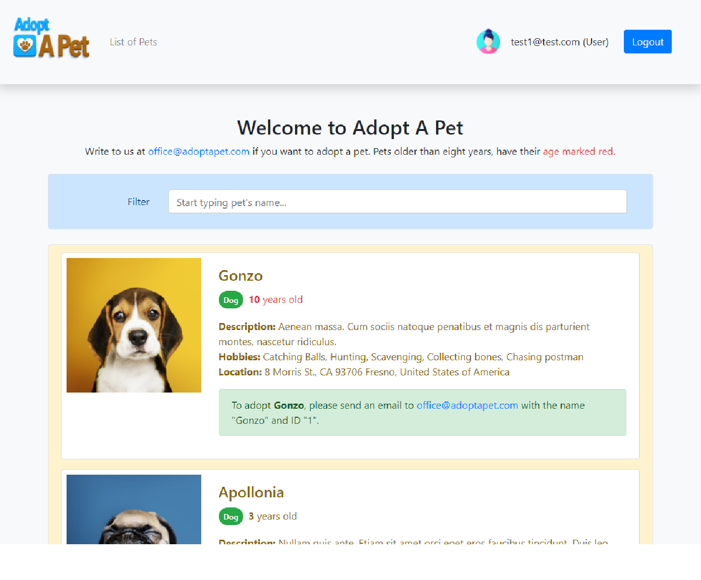
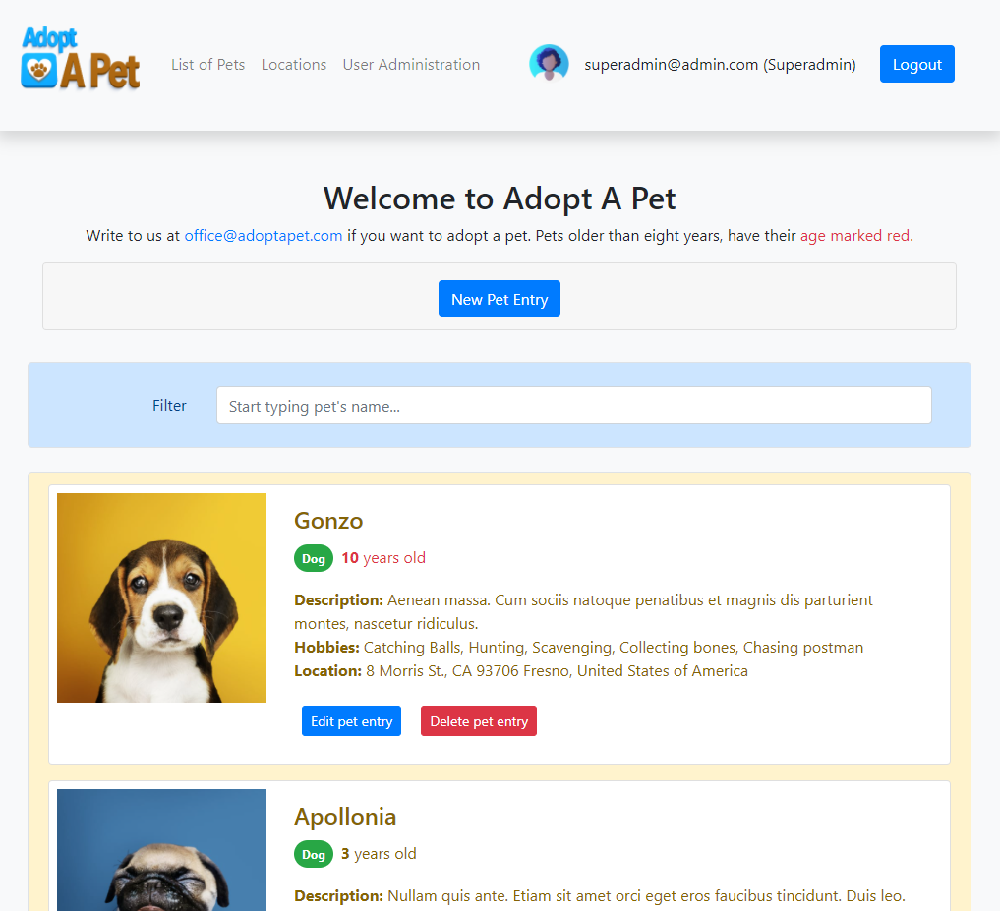
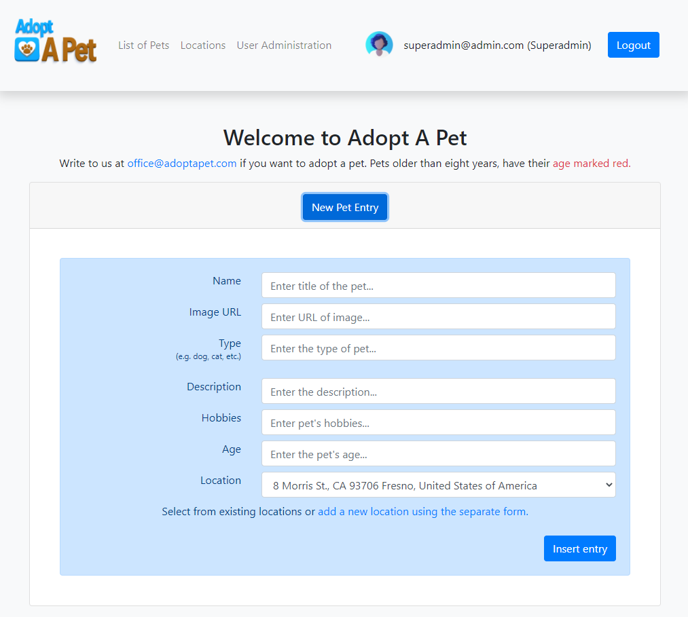
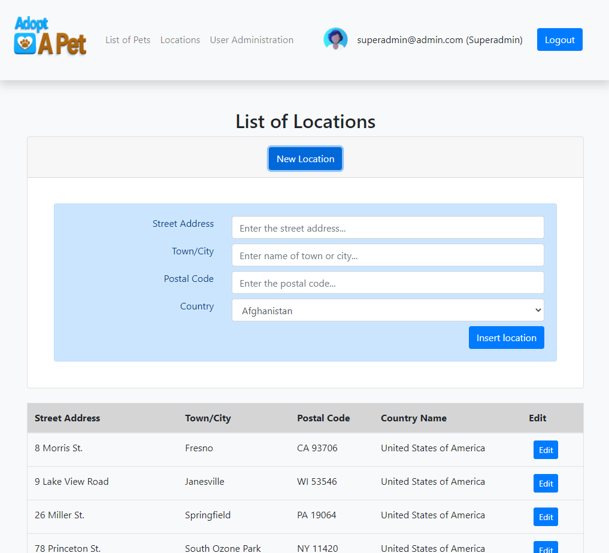
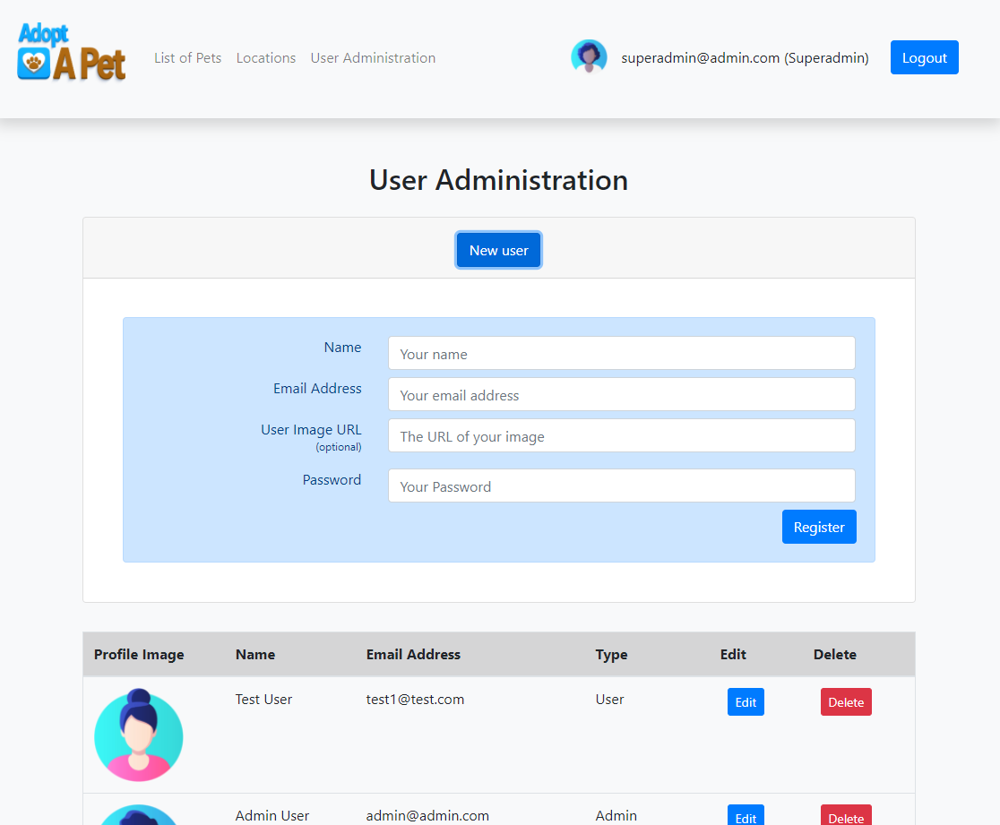
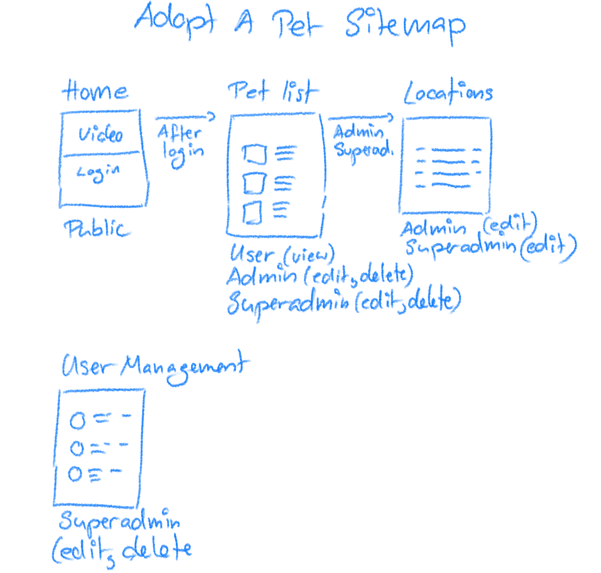
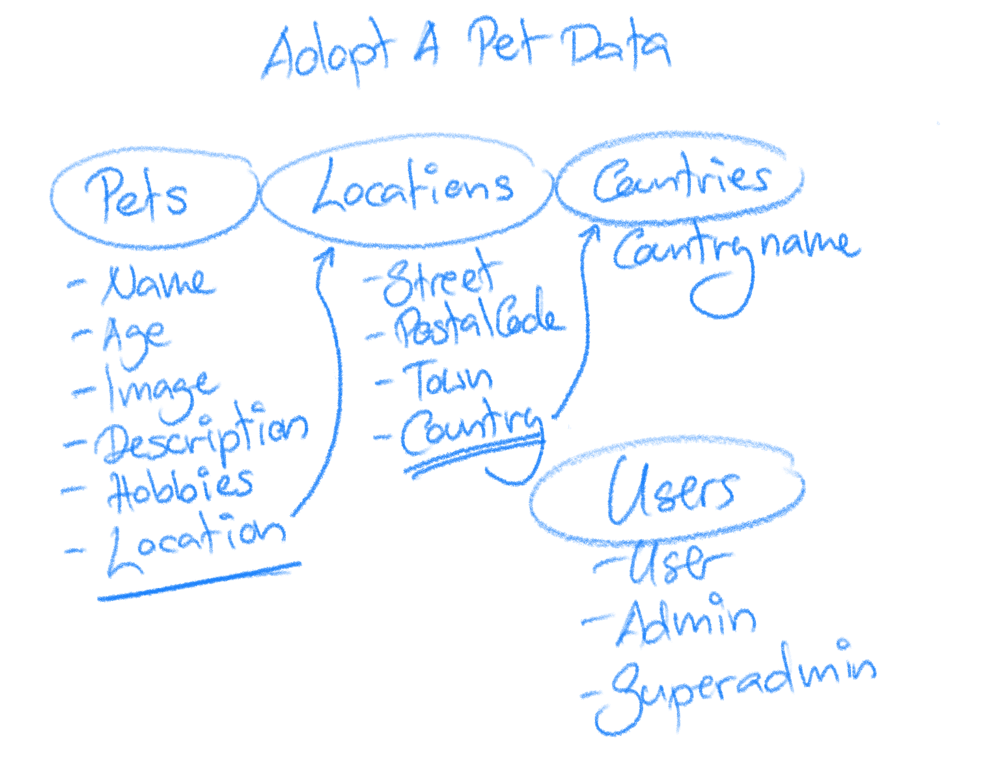

# Adopt A Pet - CFLMS CodeReview 11 MarinBalabanov

## Project description

__Please find a video of the project here: https://youtu.be/Ig9F8vZOXuY__

This is a pet database with a web frontend in Bootstrap, JQuery, PHP and MySQL. All pets have a photo and live at a specific location. They also a description, age and belong to a breed.

All animals show their name, an image, a description and a location. A location should hold information about the city, ZIP-code, address. Senior animals (older than 8 years old) have their age emphasized.

The pet list page has a __live search__ allowing users to  filter/search through the pets (this feature uses AJAX).

## Sitemap

## User Types
By default, there are three kinds of users:
- __User:__ Can access the list of pets and search/filter through it. This type of user _cannot_ create new pet entries, add new locations and create new users or change existing ones. 
- __admin:__ Can access the list of pets and search/filter through it and can create new pet entries as well as add new locations or change existing ones. This type of user _cannot_ create new users or change existing users.
- __superadmin:__ This type of user has unrestricted rights. They can access the list of pets and search/filter through it, can create new pet entries, add new locations or change existing ones and they can create new users or change existing users.

The database export provided in this repository has three predefined users. Please find their login credentials below:
- For a __standard user__ please use username __test1@test.com__ and __tatata__ as the password.
- For an __admin user__ please use __admin@admin.com__ and __tatata__ as password.
- For __superadmin__ please use __superadmin@admin.com__ and __tatata__ as password.

## Screenshots

### Adopt A Pet Home Page
On the home page users can watch a video and learn more about Adopt A Pet. They can login or register as well as see an animated HTML5 ad near the end of the page.
<kbd></kbd>

### Regular User View of Pet List
This is the main list of Adopt A Pet. Users can see all pets listed. They can filter by name using the live search.
<kbd></kbd>

### Admin and Superadmin View of Pet List
Admins and Superadmin see a variation of the pet list page. They can not only filter by name using the live search but can also add new pet entries as well as change or delete existing ones.
<kbd></kbd>

### Admin and Superadmin Create A New Pet Entry
When an Admin or Superadmin clicks on "New Pet Entry" the accordion opens up to present them with the form to create a new pet entry.
<kbd></kbd>

### Admin and Superadmin View of Locations and Create A New Location
Admins and Superadmins can see a list of all locations, edit existing ones or add new locations to the list. Locations cannot be deleted, because they are used as a foreign key in the pets table. This is not much of an issue, because admins can change existing locations or assign pets to different locations.
<kbd></kbd>

### Superadmin View of User Administration
And finally, only Superadmins can edit or delete existing users.
<kbd></kbd>

## Concept

### 1. Initial Sitemap Sketch

### 2. Initial Data Sketch

### 3. Database Diagram

